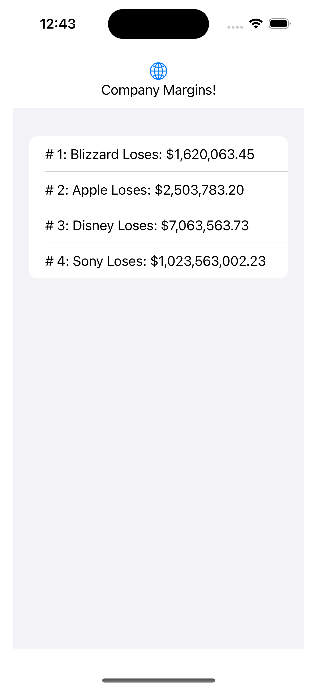

# Bubble Sort in Swift
# The WHY
Bubble sorting is one of the common and simpliest sorting algorithims in programming. There are a number of comparable sortive algorithims and they often because more complicated but their complexity often comes along with speed improvements. Here's [one](https://github.com/kodecocodes/swift-algorithm-club/tree/master/Bubble%20Sort) of many articles around the performance of Bubblesort with more detailed examples. That being said sorting is critical to many searching algorithims for example a binary search won't work without sorting so for this example we are going to combine a bubble sort and a binary search.
# The WHAT
After even more thought I was finally able to think of a use case where a system would need to sort and entire collection and then return the position of a value instead of looking for that value itself ... a RANKING SYSTEM! 

Any rank system needs to be able to compare different people or items against one another and then determine numerically how they compare against the entire of list in question, ie determining if someone is first, second, third, etc in a race based on their time to complete the race. For our example I chose an Financial loosings track which would apply for the stock market. While not an perfect example of course it lists out companies marked by how much money they have lost. Since a binary search required sorting from least to greatest there is value in a ranking system like this because the lowest value would be at the top with the highest value being at the bottom.

### Company.swift
Below is a struct to represent a Company and a struct called Money to represent the earnings made. Note the use of the Comparable protocol. It's important to be aware that complex sorting requires the datatype be comparable in some way meaning there must be an implementation of the < operator and the == operator is useful as well in this case. This is not unique to Swift and I've needed to write code like this before in other languages such as C#. 
```Swift
import Foundation
struct Company : Comparable {
    var Name : String
    var Money : Money
    
    static func < (lhs: Company, rhs: Company) -> Bool {
        return lhs.Money < rhs.Money
    }
    static func == (lhs: Company, rhs: Company){
        lhs.Money == rhs.Money
    }
}
struct Money: Comparable {
    var amount: Decimal
    
    static func < (lhs: Money, rhs: Money) -> Bool {
        return lhs.amount < rhs.amount
    }
    static func == (lhs: Money, rhs: Money){
        lhs.amount == rhs.amount
    }
}
```
### Array+Extension.swift
For our example app I've decided to make two extension methods on the Array type. One for the Binary search and the other for a BubbleSort. Please note the sorting algorithim itself doesn't matter as long as the collection is sorted in someway from least to greatest. Our results can be achieve by simply calling the built in sort function in Swift but I did see some added value by demonstration a BubbleSort in Swift but again the built in sort will work as well.
```Swift
import Foundation
extension Array {
    static func BinarySearch<T: Comparable>(from array: [T], value: T) -> Int {
        var lowerIndex = 0
        var upperIndex = array.count - 1
        
        while lowerIndex <= upperIndex {
            let middleIndex = (lowerIndex + upperIndex) / 2
            let middleValue = array[middleIndex]
            
            if middleValue == value {
                return middleIndex
            } else if middleValue > value {
                upperIndex = middleIndex - 1
            } else {
                lowerIndex = middleIndex + 1
            }
        }
        
        return -1
    }
    
    static func BubbleSort<T: Comparable>(sort array: inout [T]) {
       var countOf = array.count
       while (countOf > 0) {
           var lastModifiedIndex = 0
           for currentIndex in 1..<countOf {
               if array[currentIndex - 1] > array[currentIndex] {
                   let temp = array[currentIndex - 1]
                   array[currentIndex - 1] = array[currentIndex]
                   array[currentIndex] = temp
                   lastModifiedIndex = currentIndex
               }
           }
           countOf = lastModifiedIndex
       }
   }
    
}

```
### ContentView.swift
And finally we have a ContentView file I've adjusted to display our data. You can see the private property of the array of companies has been hard coded in no paritcular order but the constructor calls the BubbleSort method on the property so it can be adjusted before being display and voila we have a sorted list. You will also see we use the BinarySearch to return the index of a company and merely add a +1 so the ranking is more human readable.
```Swift

import SwiftUI

struct ContentView: View {
    private var BigCompanies : [Company] = [
        Company(Name: "Disney", Money: Money(amount: 7_063_563.73)),
        Company(Name: "Sony", Money: Money(amount: 1_023_563_002.23)),
        Company(Name: "Apple", Money: Money(amount: 2_503_783.20)),
        Company(Name: "Blizzard", Money: Money(amount: 1_620_063.45)),
    ]
    init() {
        Array<Any>.BubbleSort(sort: &BigCompanies)
    }
    var body: some View {
        NavigationStack {
            VStack {
                Image(systemName: "globe")
                    .imageScale(.large)
                    .foregroundColor(.accentColor)
                Text("Company Margins!")
                List {
                    ForEach(BigCompanies, id: \.Name) { company in
                        Text("# \(Array<Any>.BinarySearch(from: BigCompanies, value:company) + 1): \(company.Name) Loses: \(String(describing: company.Money.amount.formatted(.currency(code: "USD"))))")
                    }
                }
            }
            .padding()
            
        }
    }
}

struct ContentView_Previews: PreviewProvider {
    static var previews: some View {
        ContentView()
    }
}

```
# Demo
And to wrap it up here is a screenshot of what our example ios app would look like

### References
* [Swift Program to sort an array in ascending order using bubble sort](https://www.tutorialspoint.com/swift-program-to-sort-an-array-in-ascending-order-using-bubble-sort)
* [Bubble Sort with Swift](https://diningwithrobots.com/2020/06/05/bubble-sort-with-swift/)
* [Bubble Sort in Swift](https://big-o.io/examples/bubble-sort/swift/)