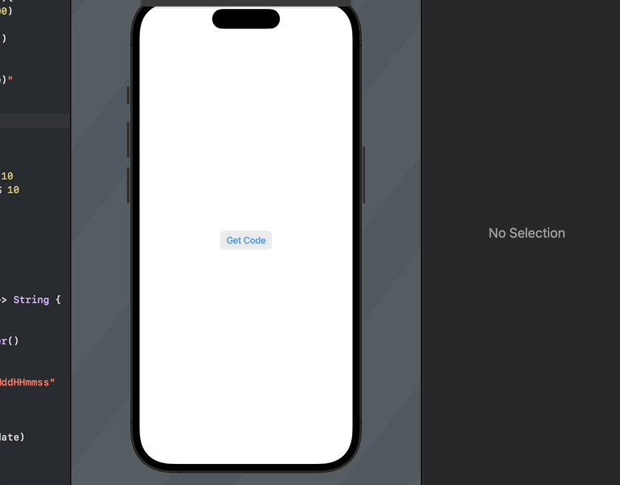

# Reverse A Number

So Reversing a number doesn't fit into the average sense of a data structure and algorithim as it is on paper it is indeed an application of a determined algorithim under normal terms. One could argue the entire algorithim itself can be broken down into four part due to how decimal base math works

1. Start a 0 and multiple by 10 as long as the target number to be reversed isn't exhausted. This will create a numerical "buffer" if you will to do addition.
2. Getting the last digit of the targer number can achieved in computing using the % also known as the modulos operator and it will also return the last digit of a solid number when %10 is applied.
3. We next need to set the current reversed to to equal to it's previous value + the last digit.
4. Finally we need to reset the target value to itself divided by 10 because with solid intergers the decimal is lost during the diving processing in computing based math.

So now that we have explained the steps involved in reversing a number then we can talk about applications. So in our current use case we are going to assume we have been requested by a company to build an app to generate access codes. As part they would like the final result to include one part a seeded value in reverse, next part is a random number between 100 and then finally the date. Now with our specs layed out lets put them in place.

```Swift
private func GenerateSequenceNumber(){
        let rand = Int.random(in: 1..<100)
        let date = currentDateAsString()
        let reversedNum = reverseNumber()
        
        generatedNumber = "\(reversedNum)\(rand)\(date)"
    }
    
    private func reverseNumber()->Int {
        var seed = 123445
        var reversedNum = 0
        while(seed != 0){
            reversedNum = reversedNum * 10
            let lastDigitOfSeed = seed % 10
            reversedNum = reversedNum + lastDigitOfSeed
            seed = seed/10
        }
       return reversedNum
    }
    
    private func currentDateAsString() -> String {
        let date = Date()
        // Create Date Formatter
        let dateFormatter = DateFormatter()

        // Set Date Format
        dateFormatter.dateFormat = "YYMMddHHmmss"

        // Convert Date to String
        let formattedResult = dateFormatter.string(from: date)
        return formattedResult
    }
```
### Videos
