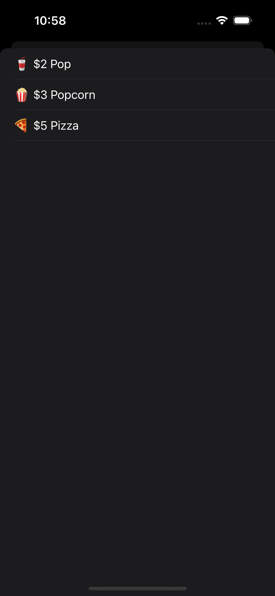

# Array
An array is a collection of items. It is possibly the most common data structure across all programming languages
Is this example we are building a snack bar with a few items a customer could purchase on there phone. We can populate the snack items from an Array. 

### MenuViewModel
We first set the array of Snack items in a View Model built for our View
```swift
//
//  MenuViewModel.swift
//  SnackBar
//
//  Created by richard Haynes on 2/12/23.
//
// https://stackoverflow.com/questions/32505544/how-to-include-emoticons-in-swift-string
// "ctrl + cmd + space" will pop up the emoji keyboard
import Foundation
final class MenuViewModel {
    static var Snacks : [Snack] = [
        Snack(Name: "Pop", Price: 2.00, Image: "🥤"),
        Snack(Name: "Popcorn", Price: 3.00, Image: "🍿"),
        Snack(Name: "Pizza", Price: 5.00, Image: "🍕")
    ]
}

```
### MenuTableViewController
We then have some code in our table view that uses a computed property to get the snacks but filters out any snack that doesn't have an image for being displayed.
```swift
//
//  MenuTableViewController.swift
//  SnackBar
//
//  Created by richard Haynes on 2/12/23.
//
// https://www.youtube.com/watch?v=QqGak909E-c&t=497s
// https://www.programiz.com/swift-programming/library/array/filter
// https://developer.apple.com/documentation/swift/sequence/filter(_:)
// https://www.hackingwithswift.com/example-code/language/how-to-remove-items-from-an-array-using-filter
import UIKit

class MenuTableViewController: UITableViewController {
    private var Snacks: [Snack] {
        // Filters out any item that doesn't have an emoji image
        return MenuViewModel.Snacks.filter {$0.Image != nil}
    }
    override func viewDidLoad() {
        super.viewDidLoad()
        
        tableView.register(UITableViewCell.self, forCellReuseIdentifier: "cell")
    }

    // MARK: - Table view data source
    
    override func tableView(_ tableView: UITableView, numberOfRowsInSection section: Int) -> Int {
        return Snacks.count
    }
    
    override func tableView(_ tableView: UITableView, cellForRowAt indexPath: IndexPath) -> UITableViewCell {
        let cell = tableView.dequeueReusableCell(withIdentifier: "cell", for: indexPath)
        cell.textLabel?.text = Snacks[indexPath.row].FormatedDisplay()
        return cell
    }

}

```

### ScreenShots
 
