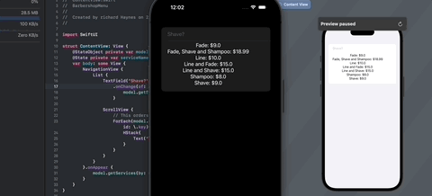

# Dictionary
A dictionary is a collection of key value pairs. A key value pair is simply a value that can be of any existing type in the Swift language even another dictionary itself and key which can also be any type as well but has the restriction the the key numst be unique. Dictionaries are very powerful for looking up data because since the key must be unique. There are a number of situations outside of those where the dictionary might be preferred over the Array.

In the below example we will be build an app to display a barbershops service menu and the prices for those services.
## Service.swift
```swift
//
//  Service.swift
//  BarbershopMenu
//
//  Created by richard Haynes on 2/24/23.
//

import Foundation
struct Service {
    let name : String
    let price : Double
    init(name: String, price: Double) {
        self.name = name
        self.price = round(price * 100) / 100.0 // This will round up to 2 decimal places.
    }
}


```

## Services.swift
```swift
//
//  Services.swift
//  BarbershopMenu
//
//  Created by richard Haynes on 2/24/23.
//

import Foundation
struct Services {
    static let allServices: [String : Service] = [
        "Line" : Service(name:"Line", price : 10.00),
        "Shave" : Service(name:"Shave", price : 9.00),
        "Fade" : Service(name:"Fade", price : 9.00),
        "Shampoo" : Service(name:"Shampoo",price : 8.00),
        "LineShave" : Service(name:"Line and Shave",price : 15.00),
        "LineFade" : Service(name:"Line and Fade", price : 15.00),
        "FadeShaveShampoo" : Service(name:"Fade, Shave and Shampoo", price : 18.99)
    ]
}

```
In the above example we've used a dictionary here because the service having a name or description with spaces is much easier for human based readability but spacing can make filtering and searching more difficult and accident prone. So our key will be a spaceless to help with searching and filtering.

## BarbershopViewModel
```swift
//
//  BarbershopViewModel.swift
//  BarbershopMenu
//
//  Created by richard Haynes on 2/24/23.
//

import Foundation
final class BarbershopViewModel: ObservableObject {
    @Published var services: [String : Service] = ["" : Service(name: "", price: 0.00)]
    
    func getServices(by name : String){
        if name == ""{
            services = Services.allServices
        }
        else{
            services = Services.allServices.filter {$0.key.contains(name)}
            
        }
    }
}

```
## ContentView.swift
```swift
//
//  ContentView.swift
//  BarbershopMenu
//
//  Created by richard Haynes on 2/24/23.
//

import SwiftUI

struct ContentView: View {
    @StateObject private var model = BarbershopViewModel()
    @State private var serviceName : String = ""
    var body: some View {
        NavigationView {
            List {
                TextField("Shave?", text: $serviceName)
                    .onChange(of: serviceName){ service in
                        model.getServices(by: serviceName)
                    }
                
                ScrollView {
                    // This orders the services in alphabetical order
                    ForEach(model.services.sorted(by: {$0.key < $1.key}), id: \.key){ key, value in
                        HStack{
                            Text("\(value.name)"+": $\(value.price)")
                        }
                    }
                }
            }
        }.onAppear {
            model.getServices(by: serviceName)
        }
    }
}

struct ContentView_Previews: PreviewProvider {
    static var previews: some View {
        ContentView()
    }
}

```

### Videos
