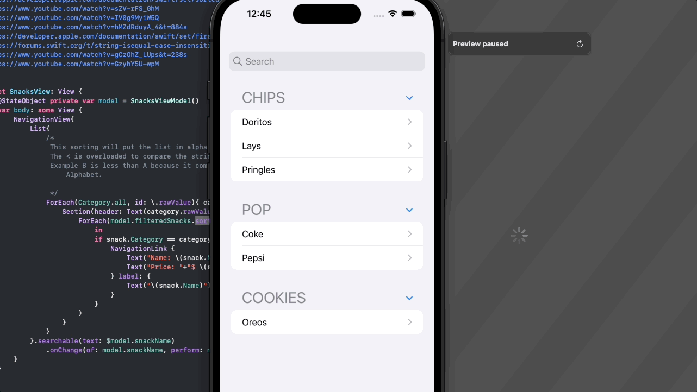

# Set
A set is Swift data structure that is very similiar to an array with 2 main differences. First unlike an array a set can not have any duplicate values inside of the set and second a set is unordered, meaning unlike an array when you entered in data into the set it does not get a specific and constance placement.

For those curious on why these details might be valuable the first and foremost is speed of look up. A set can't have duplicates because it internally creates a hash look up of the items. This hashed based unqiueness means values can be found very quickly efficiently.

## Use Case
For our example use case we are going to be building a simple snacks menu that is going to group our items by category and show them in alphabetical order. The next feature of our menu will the ability to search for a selected item.

## Category
```Swift
import Foundation
enum Category : String{
    case Pop = "Pop"
    case Chips = "Chips"
    case Cookies = "Cookies"
    
    static var all : [Category] {
        return [Chips,Pop,Cookies]
    }
}
```
## Snack
```Swift
import Foundation

struct Snack: Hashable, Comparable{
    static func < (lhs: Snack, rhs: Snack) -> Bool {
        return lhs.Name < rhs.Name
    }
    
    let Id : UUID
    let Name : String
    let Price: Decimal
    let Category: Category
    
    init(name: String, price: Decimal, category: Category) {
        self.Id = UUID()
        self.Name = name
        self.Price = price
        self.Category = category
    }
}

```
Our above model is going to be used to represent our Snack items. Since a set internal uses hash based look ups anything that gets inserted into a set must conform to the Hashable protocol. Reference types like classes are more complext to make conform to that protocol but structs being value types conform naturally. Next we want our Set to conform to the Comparable protocol. This means we need to override either the ' < ' or the ' > ' operators. We only need to handle one because one we take care of one swift can determine how to logicially handle it's inverse.

## SnacksViewModel

```Swift
import Foundation
final class SnacksViewModel: ObservableObject {
    @Published var searchedSnack: Snack? = nil
    @Published var snackName: String = ""
    
     let Snacks: Set<Snack>=[
        Snack(name: "Pepsi", price: 2.00, category: .Pop),
        Snack(name: "Coke", price: 2.00 ,category: .Pop),
        Snack(name: "Doritos", price: 3.25, category: .Chips),
        Snack(name: "Lays", price: 3.00, category: .Chips),
        Snack(name: "Pringles", price: 3.50, category: .Chips),
        Snack(name: "Oreos", price: 3.00, category: .Cookies),
    ]
    
    var filteredSnacks: Set<Snack> {
        if let snack = searchedSnack {
            var snacks : Set<Snack> = []
            snacks.insert(snack)
            return snacks
        }
        return Snacks
    }
    
    func searchSnacks(name: String) {
        searchedSnack = Snacks.first(where: {$0.Name.localizedCaseInsensitiveContains(name)})
    }
    
}

```
Above is our view model that is going to be used to house our list of snacks which is harder coded for the sake of this sample. It will also contain the business logic needed for our view search and filtering abilities.

## SnacksView
```Swift
struct SnacksView: View {
    @StateObject private var model = SnacksViewModel()
    var body: some View {
        NavigationView{
            List{
                /*
                 This sorting will put the list in alphabetical order.
                 The < is overloaded to compare the string property of the snack name.
                 Example B is less than A because it comes after A in the english Alphabet.
                    
                 */
                ForEach(Category.all, id: \.rawValue){ category in
                    Section(header: Text(category.rawValue).font(.title)){
                        ForEach(model.filteredSnacks.sorted(by: <), id: \.Id){ snack in
                            if snack.Category == category {
                                NavigationLink {
                                    Text("Name: \(snack.Name)")
                                    Text("Price: "+"$ \(snack.Price)")
                                } label: {
                                    Text("\(snack.Name)")
                                }
                            }
                        }
                    }
                }
            }.searchable(text: $model.snackName)
                .onChange(of: model.snackName, perform: model.searchSnacks)
        }
    }
}

struct ContentView_Previews: PreviewProvider {
    static var previews: some View {
        SnacksView()
    }
}
```
With everything we've done in advance we are able to build a view that can group our data by categories and display in alphabetical order. This is achieved by calling the set's sorted method which will use comparable method we overode to know how to order the items. Because we've overrided the < operator and based it off the name of the snack this has the effect of putting the list into alphabetical order because A is greater than B etc.

# Final Thoughts

So when all things are said and done why did a set work better here? From a logical standpoint a set is better because the data shouldn't have duplicates it simply doesn't make sense. Aside from that with an application with this much data it doesn't truly matter. The fact the Set is unordered didn't impact our use case was because we were going to re-order the data as part of our requirements. This would have happened if it was an array or a set. Both sorted methods have an O(n log n) time complexity when being sorted. Also the first(where) used in the searching is a O(n) complexity for both an array or set. From a purely logically standpoint since most algorithims applied on the data have the same time complexity then the factors that apply becomes the amount of data itself and the data structure. If the data is the same then the structure that won't allow duplicates will win if this doesn't break a business requirement. Only because the removal of duplicates means the data set will be smaller if there where duplicates. That being said again for this example all of that is irrelevant because the data was hard coded and a developer is in full control and it's extremely small so duplicate values are not a valid concern.

## Demos
