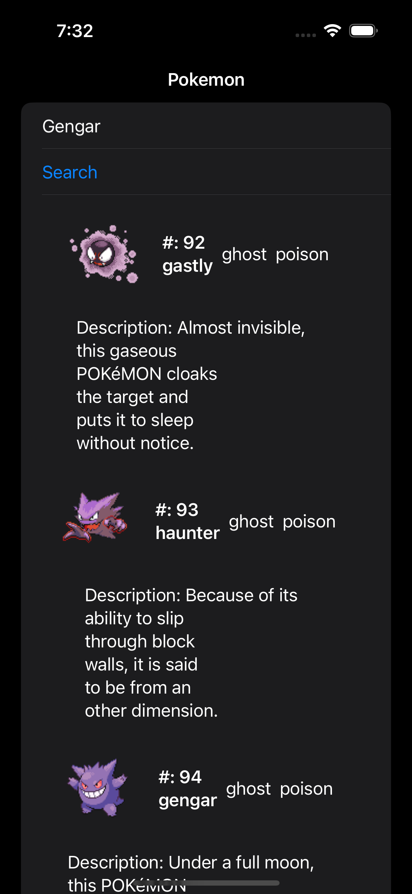
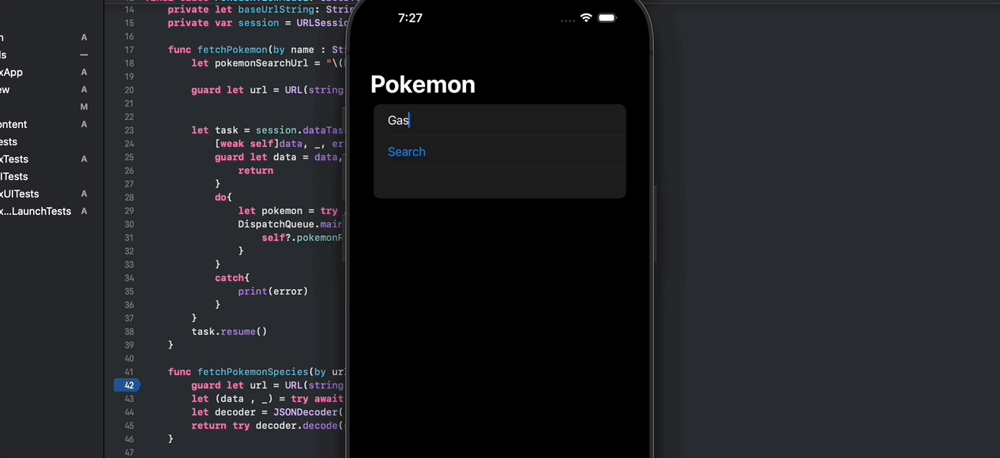

# APIs

This section is about making Swift apps that gather data from external APIs. For those unfamiliar API is short for Application Programming Interface. It's the process of exposing some data or features to another application often over the internet. Working with APIs is a critical skill for developers of any type but especially mobile developes. Mobile developers are very limited in the amount of data they can store and processing they can do as they are limited by the power of the user phone. 
When working with APIs there are a number of key concepts that are critical in working with APIs. Each of them are worthwhile topics to understand and research in detail independently. Since this article itself is about the concept of calling APIs it avoids going into too much depth into these areas but will hopefully give enough knowledge so that the code written makes reasonable sense. Also note that while the language being used in swift most of these concepts are the same across all programming concepts.

## Sub-Topics

* [JSON](https://www.w3schools.com/whatis/whatis_json.asp)
First on our list to cover is JSON. JSON is short for Javascript Object Notation and JSON is simply format used when sending data across networks. While it is not the only format, XML, HTML and even plain text can be sent it is by far the most popular and most commonly used format due in part to its creater flexbility than plain text but it being far easier to read and work with than XML. JSON is a key value pair format much like how a dictionary is a key value. It is merely names of things and then the thing itself.

* [Decoding](https://developer.apple.com/documentation/foundation/jsondecoder)
Decoding is the procress of taking JSON and turn that JSON object and turning into some other data type. In programming languages developers often decode json into either classes or structs since JSON object often have many properties which are often JSON objects or Arrays of JSON objects.
* [Codable](https://www.swiftbysundell.com/basics/codable/)
The codable protocol is the first Swift specific concept but this protocol is what allows a class or struct in Swift that it can get its values from a JSON object. 
NOTE! Marking a class or struct as inherting from codable alone is not enough for ensure correct decoding of a JSON object. For the target type to properly decode it must have properties with name and types that can be translated from the JSON object. For example if there is a lowercased property with underscores in the JSON object that you are trying to decode there the structure of class needs a propery with the exact same name underscores and all. The types must also be comparable as well. If the json property is a string the swift property must be a string. If the JSON property trying to be decode is also itself a JSON object then the swift type must have a property that is also a struct or class that inherits from codable that has properties named the same as the sub JSON object.

* [URLSession](https://cocoacasts.com/networking-fundamentals-how-to-make-an-http-request-in-swift)
The URLSession class is an API itself built into the swift language that gives all the code needed to support an app communicating over the internet. The URLSession will provide a shared singleton instance of itself so that don't have to be wasteful with memory when trying to make requests over the internet. The requests are handled in the form of data tasks. Which can either fail or succeed and either return data or perform an operation.
* [Async/Await/Tasks](https://www.avanderlee.com/swift/async-await/)
Async Await and Tasks is a critical concept in mordern programming. It resolves around the concep of allow applications to use the more powerful and more modern multi-threading CPUs. In short it's the concept of asynchronously(starting a process after another had started but before it finished) allowing tasks

# Example
To make an example to follow on how we can use these features we are going to build our own Pokedex like that from the Pokemom anime. 
## Pokemon
```swift
//
//  Pokemon.swift
//  MyPokedex
//
//  Created by richard Haynes on 2/17/23.
//
// https://app.quicktype.io
import Foundation

struct Pokemon: Hashable, Codable {
    let sprites : Sprites
    let id: Int
    let name: String
    let types : [Types]
    let species : Species
}

struct Sprites: Codable, Hashable{
    let front_default: String
}

struct Species: Codable, Hashable {
    let name: String
    let url: String
}

struct type: Codable, Hashable {
    let name: String
    let url: String
}

struct Types: Codable, Hashable{
    let slot : Int
    let type : type
}

struct species: Codable, Hashable{
    let name: String
    let flavor_text_entries: [FlavorText]
}

struct FlavorText: Codable, Hashable{
    let flavor_text: String
}

```
## PokedexViewModel
```swift
//
//  PokedexViewModel.swift
//  MyPokedex
//
//  Created by richard Haynes on 2/17/23.
//
// Dittio Example https://pokeapi.co/api/v2/pokemon/ditto
// https://www.youtube.com/watch?v=dVtnFH4m_fE
// https://www.hackingwithswift.com/quick-start/concurrency/how-to-run-tasks-using-swiftuis-task-modifier

import Foundation
final class PokedexViewModel: ObservableObject{
    @Published var pokemonResults: [Pokemon] = []
    private let baseUrlString: String = "https://pokeapi.co/api/v2/pokemon/"
    private var session = URLSession.shared
    
    func fetchPokemon(by name : String) {
        let pokemonSearchUrl = "\(baseUrlString)\(name.lowercased())"
        
        guard let url = URL(string: pokemonSearchUrl) else {return}
        
        
        let task = session.dataTask(with: url){
            [weak self]data, _, error in
            guard let data = data, error == nil else {
                return
            }
            do{
                let pokemon = try JSONDecoder().decode(Pokemon.self, from: data)
                DispatchQueue.main.async {
                    self?.pokemonResults.append(pokemon)
                }
            }
            catch{
                print(error)
            }
        }
        task.resume()
    }
    
    func fetchPokemonSpecies(by urlString: String) async throws -> species?{
        guard let url = URL(string: urlString) else {return nil}
        let (data , _) = try await session.data(from: url)
        let decoder = JSONDecoder()
        return try decoder.decode(species.self, from: data)
    }
    
}

```
In the above code sample we are making a call to the pokeapi using the URLsession.shared. We creating a datatask to return the results to our app and then we will decode the results from the API call into our codable Pokemon struct. Once we have that data we will present it to our view.

## ContentView
```swift
//
//  ContentView.swift
//  MyPokedex
//
//  Created by richard Haynes on 2/17/23.
//

import SwiftUI
// https://www.youtube.com/watch?v=r3O90QGKv98
// https://www.youtube.com/watch?v=CimY_Sr3gWw
// https://www.youtube.com/watch?v=Qk5s-6ldNfA
// https://developer.apple.com/documentation/swiftui/textfield
// https://www.youtube.com/watch?v=9QhhpeYKjOs
// https://wwdcbysundell.com/2021/using-async-await-with-urlsession/
//
struct ContentView: View {
    @StateObject var model = PokedexViewModel()
    @State var speciesList : [species] = []
    @State private var pokemonToSearch : String = ""
    var body: some View {
        NavigationView {
            List{
                TextField(text: $pokemonToSearch, prompt: Text("Enter Pokemon Name"))
                {
                    Text("Pokemon")
                }
                Button("Search"){
                    model.fetchPokemon(by: pokemonToSearch)
                }
                ScrollView {
                    ForEach(model.pokemonResults, id: \.self){ pokemon in
                       
                        HStack{
                            
                            let imageUrl = URL(string: pokemon.sprites.front_default)
                            AsyncImage(url: imageUrl)
                            
                            Text("#: \(pokemon.id) \(pokemon.name)").bold()
                            
                            ForEach(pokemon.types, id: \.self){
                                type in
                                Text(type.type.name)
                            }.onAppear() {
                                Task{
                                    let species = try await model.fetchPokemonSpecies(by: pokemon.species.url)
                                    self.speciesList.append(species!)
                                }
                            }
                            
                        }
                        .padding(4)
                        
                        HStack{
                            let flavortext = speciesList.first(where: {$0.name == pokemon.name})?.flavor_text_entries.first?.flavor_text ?? ""
                            Text("Description: \(flavortext)")
                        }
                    }
                }
            }
            .navigationTitle("Pokemon")
            
        }
    }
}

struct ContentView_Previews: PreviewProvider {
    static var previews: some View {
        ContentView()
    }
}

```
### ScreenShots
 

### Videos
