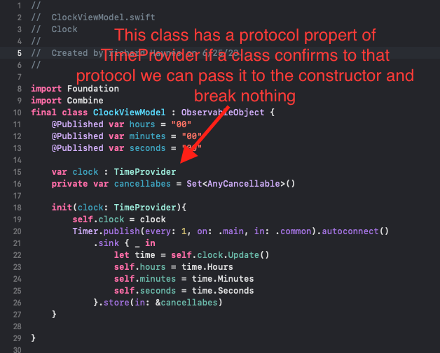
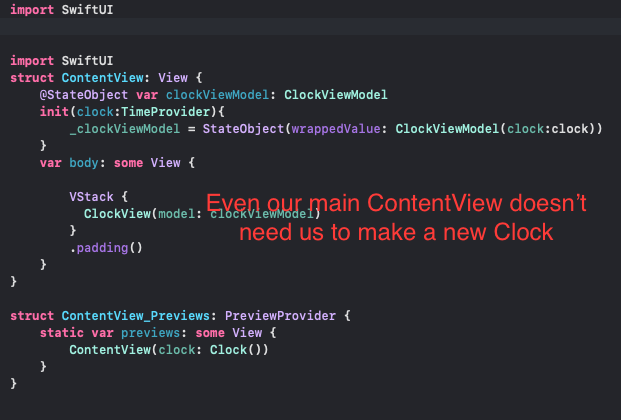
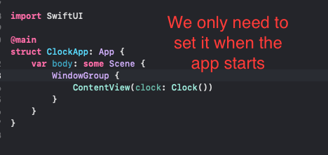

# Dependency Injection
So what is Dependency Injection or DI for short? We are not giving the official defination because that can be googled. In being simple DI is simply having classes or structs that take protocols in their constructors to set a property and thats it. What this is trying to do is trying to reduce the number of times you need to make a new instance of a class but that actually means you can switch out business logic easier and if you can switch out business logic you code break less because you change something. The last part is key it helps you not break your code if you change something.

So now lets to take a look at this in the real world. Below I have a model that only has a protocol not a new instance of a class.

Even the ContentView doesn't need to know the details of the class itself and its details.

Only the app itself needs the to be the place we new up the class.

